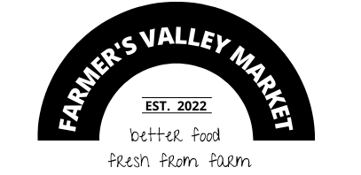
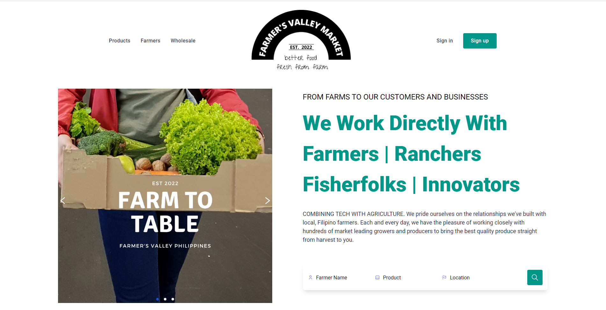

  <h1>
     
    
     
    Fresh Produce
     
  </h1>
  <h4>
    <a href="#links">Links</a>
    •
    <a href="#versions">Versions</a>
    •
    <a href="#roadmap">Roadmap</a>
    •
    <a href="#development-guide">Development guide</a>
    •
    <a href="#deployment">Deployment</a>
    •
    <a href="#contact">Contact</a>
    •
    <a href="#copyright">Copyright</a>
  </h4>
  <h3>
    
    
    
  </h3>

### 

To organize the agri ecosystem in the Philippines through technology and data. Improve the lives of agri players involved in the agri value chain or agri ecosystem, which includes farmers, wholesalers, resellers, retailers, aggregators, and supply chain players.

## Table of contents

* [Links](#links)
* [Versions](#versions)
  * [Numbering](#numbering)
  * [Major releases](#major-releases)
* [Roadmap](#roadmap)
  * [Content](#content)
  * [Features](#features)
  * [Technical](#technical)
* [Development guide](#development-guide)
  * [Prerequisites](#prerequisites)
    * [Microsoft Windows](#microsoft-windows)
    * [Git for Windows](#git-for-windows)
    * [GitHub setup](#github-setup)
    * [Local repository](#local-repository)
      * [Clone](#clone)
      * [Configure](#configure)
    * [Jekyll](#jekyll)
  * [Running the website locally](#running-the-website-locally)
  * [Recommended tools](#recommended-tools)
    * [Chromium-based browser](#chromium-based-browser)
    * [Visual Studio Code](#visual-studio-code)
    * [Microsoft Word](#microsoft-word)
    * [Adobe Photoshop](#adobe-photoshop)
  * [Contributions](#contributions)
* [Deployment](#deployment)
* [Contact](#contact)
* [Copyright](#copyright)

## Links

## Versions

### Numbering

### Major releases

## Roadmap

### Content

### Features

### Technical

## Development guide

### Prerequisites

.

#### Microsoft Windows

#### Git for Windows

#### GitHub setup

#### Local repository

##### Clone

##### Configure

#### Jekyll

### Running the website locally

### Recommended tools

#### Chromium-based browser

#### Visual Studio Code

#### Microsoft Word

#### Adobe Photoshop

### Contributions

## Deployment

## Contact

If you need to get in-touch with me ([Grail Willy](https://github.com/grailwilly) – developer), please do so at the following email address: [grailjwi11y@gmail.com](mailto:grailjwi11y@gmail.com?subject=fresh%20Produce%20Website)

## Contributors

<table>
  <tr>
    <td align="center"><a href="https://github.com/johndominicvillalino">
       
        <b>JD Villalino</b></a>
       
      <a href="" title="Code">💻</a> 
      <a href="" title="Tests">⚠️</a> 
      <a href="" title="Bug reports">🐛</a>
      <a href="" title="Content">🖋</a>
      <a href="" title="Documentation">📖</a> 
      <a href="" title="Design">🎨</a>
      <a href="" title="Examples">💡</a>
      <a href="" title="Ideas, Planning, & Feedback">🤔</a>
     </td>
     <td align="center"><a href="https://github.com/grailwilly">
       
        <b>Grail Willy</b></a>
       
      <a href="" title="Code">💻</a> 
      <a href="" title="Tests">⚠️</a> 
      <a href="" title="Bug reports">🐛</a>
      <a href="" title="Content">🖋</a>
      <a href="" title="Documentation">📖</a> 
      <a href="" title="Design">🎨</a>
      <a href="" title="Examples">💡</a>
      <a href="" title="Ideas, Planning, & Feedback">🤔</a>
     </td>
   </tr>
</table>
